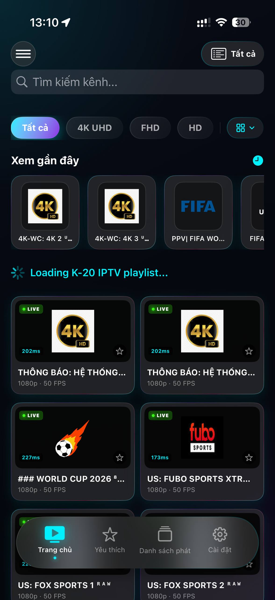
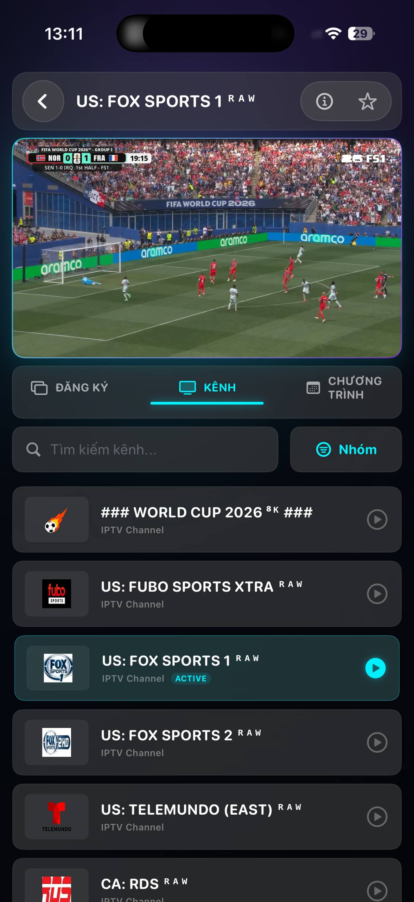
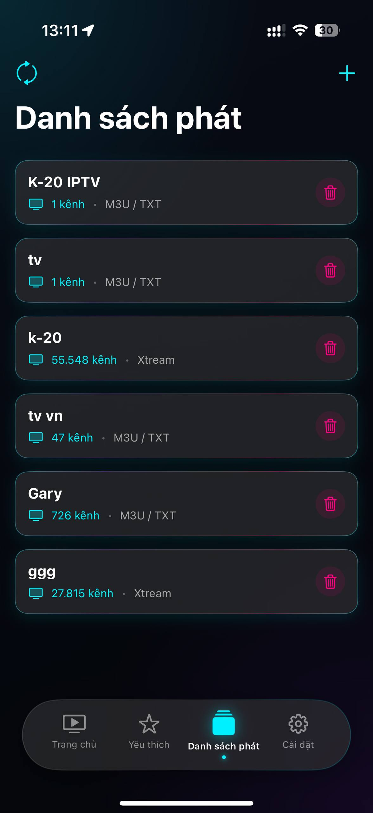
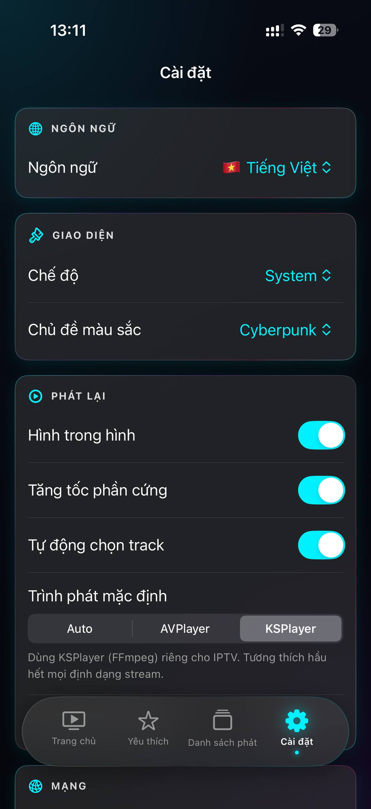

# KIPTV - Premium IPTV Player for iOS & iPadOS

**KIPTV** is a modern, high-performance IPTV client application built entirely in **SwiftUI** for iPhone and iPad devices. Designed with a stunning **Futuristic / Glassmorphism** user interface, KIPTV offers a premium, intuitive, and seamless live streaming experience.

---

## 📸 App Interface

Here are some actual screenshots of the application:

  
  
  
  

*(Please replace `screenshot1.png`, `screenshot2.png`, `screenshot3.png`, and `screenshot4.png` with your own app screenshots)*

---

## ✨ Key Features

### 🎨 1. Premium UI & Custom Themes
* **Glassmorphic Design**: Features elegant frosted-glass effects and smooth ambient gradients for a high-end look and feel.
* **Personalized Themes**: Choose from 5 vibrant neon color presets in Settings:
  * **Cyberpunk** (Default)
  * **Sunset Gold**
  * **Toxic Green**
  * **Hot Pink**
  * **Ocean Blue**
* **OLED Friendly**: Locked in dark mode to save battery on OLED screens and provide comfortable night viewing.

### ⚙️ 2. Smart Hybrid Playback Engine
* **AVPlayer**: Uses Apple's native system player for hardware acceleration, maximum power efficiency, and smooth playback.
* **KSPlayer (FFmpeg/VLC-based)**: An advanced fallback engine that handles complex live streams and audio/video codecs that AVPlayer cannot process.
* **Automatic Fallback**: The app automatically detects stream failures and seamlessly switches to KSPlayer to keep your playback uninterrupted.

### 🕹️ 3. Intuitive Gesture Controls
* Swipe up/down on the **left side of the screen** to adjust **brightness**.
* Swipe up/down on the **right side of the screen** to adjust **volume**.
* Double-tap to play/pause or fast-forward/rewind during full-screen playback.

### 📅 4. EPG (Electronic Program Guide) Syncing
* Automatically parses program schedule data embedded in M3U files or loaded from external EPG URLs.
* Displays "Now Playing" and "Up Next" guides alongside timelines in the player screen.

### 📂 5. Multi-Source Playlist Management
* **M3U / TXT**: Load playlists via online links (URLs) or import local files directly from the iOS *Files* app.
* **Xtream Codes API**: Easily add Xtream accounts (Server URL, Username, Password) to automatically categorize live feeds.
* Playlists are stored securely and can be refreshed automatically on app launch or manually via settings.

### 📺 6. Advanced Playback Features
* **Picture-in-Picture (PiP)**: Keep watching your favorite news or sports matches while multi-tasking in other apps.
* **AirPlay Support**: Cast live video streams to Apple TV or compatible Smart TVs with a single tap.
* **Audio & Subtitle Track Selection**: Easily toggle between different audio tracks, languages, or subtitles embedded in the stream.

---

## 🌐 Localization

The application is fully localized and supports:
* 🇻🇳 **Vietnamese** (Tiếng Việt)
* 🇺🇸 **English** (Default)
* 🇨🇳 **Chinese** (中文)

---

## 🛠️ System Requirements

* **Operating System**: iOS / iPadOS 17.6 or newer.
* **IPA Installation**: Can be sideloaded using **TrollStore** (recommended), **AltStore**, **Sideloadly**, or **Scarlet**.
